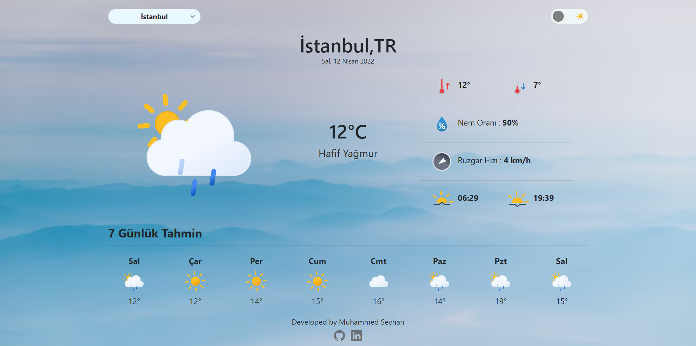
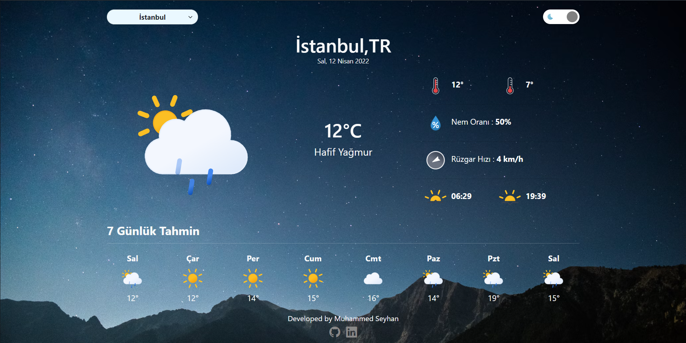

<h1 align="center">React Weather App </h1>

A Weather App Created With React

<h3 align="center"><a href="https://muhammedseyhann-react-weather-app.netlify.app" target="_blank">See Demo Here</a></h3>

 

 

</img>
</img>

## Built with

-   [React Js](https://reactjs.org)
-   [Bootstrap 5.1](https://getbootstrap.com/)
-   [Bootstrap Icons](https://icons.getbootstrap.com/)
-   [axios](https://www.npmjs.com/package/axios/)
-   [Weather Icons](https://bas.dev/projects/weather-icons)
-   [Cities of JSON](https://gist.github.com/ozdemirburak/4821a26db048cc0972c1beee48a408de)

## Contact

-   [Linkedin](https://www.linkedin.com/in/muhammedseyhann/)
